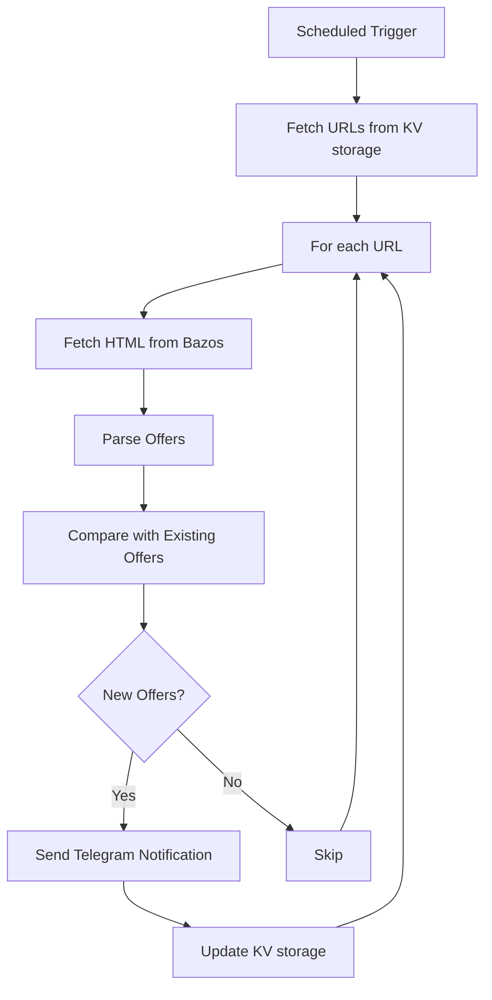

# Bazos watchdog

> A simple automated watchdog for Bazos.cz/Bazos.sk portals that periodically
> checks the specified URLs and sends a Telegram message when a new offer
> appears

## Technologies
- Cloudflare Workers & KV storage
- [Deno](https://deno.com/) runtime & denoflare for deploying to CF Workers
- Telegram bot

## Prerequisites
1. Create a Telegram bot (follow these  [instructions](https://gist.github.com/dideler/85de4d64f66c1966788c1b2304b9caf1))
2. Register a [webhook](https://core.telegram.org/bots/api#getting-updates) using the Telegram API 
3. Install [Denoflare](https://denoflare.dev/) for managing CF deployments

## How it works

The application follows this flow:

## Components

1. **Scheduled Trigger**: Cloudflare Worker runs on a schedule (currently once every hour) to check for new offers
2. **KV Storage**: Stores watched URLs and existing offers
3. **Offer Processing**: Parses HTML from Bazos to extract offer details
4. **Telegram Integration**: Sends notifications when new offers are found

## Environment Variables
- `TELEGRAM_API_KEY`: Telegram API key
- `TELEGRAM_WEBHOOK_SECRET`: Secret string for verifying incoming webhooks from Telegram when a new message is received

## Commands
- `deno run dev` - Local development server
- `deno run deploy` - Deploy code to CF Workers
**Note**: after every deployment, you have to **manually re-enable logging** in the CF dashboard, because *denoflare* currently doesn't support this flag and overwrites the settings every time 😏